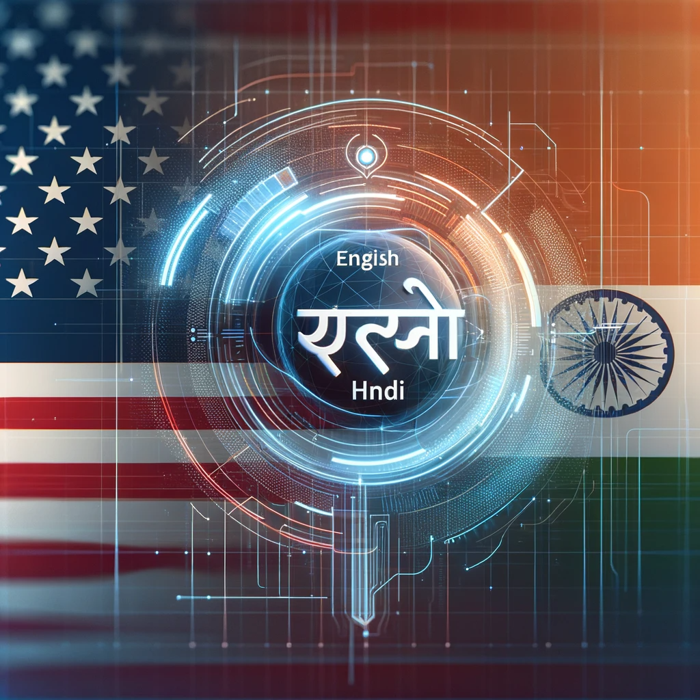

# Quick demo available at: [HF spaces](https://huggingface.co/spaces/fubuki119/Machine-Translation_eng-hin)

# Machine Translation (English to Hindi)


A Deep learning Model for English to Hindi translation.



# Project Overview
## Introduction

This project focuses on Machine Translation using advanced Deep Learning algorithms. Our goal is to develop a system capable of translating English sentences to Hindi with high accuracy and efficiency. The implementation is twofold:

1. A custom-built transformer model developed in PyTorch, trained from
scratch on a specialized dataset.
2. A fine-tuned version of [opus-mt-en-hi model](https://huggingface.co/Helsinki-NLP/opus-mt-en-hi), adapted to [IITB-english-hindi](https://huggingface.co/datasets/cfilt/iitb-english-hindi)


# Objectives
- To explore and implement state-of-the-art deep learning techniques in the field of natural language processing.
- To provide a reliable and efficient English-to-Hindi translation service.

# Installation and Setup
> Clone the Repository
```
git clone https://github.com/VaruN-dev-dev/Machine-Translation.git
```

> Navigate into the Repository

```
cd Machine-Translation
```

> Crete a Virtual Environment

```
conda create -p venv
```
> Activate the Virtual Environment

```
conda activate venv/
```

> Install dependencies

```
pip install .
```

> Running the Gradio App

```
python app.py
```

## Codes and Resources Used
In this section I give user the necessary information about the software requirements.
- **Editor Used:**  Visual Studio Code
- **Python Version:**  Python 11.0

## Python Packages Used
The project relies on several Python packages, all of which are listed in `requirements.txt.`

# Data
## Source Data/ Data Acquisition
The project utilizes the [iitb-english-hindi](https://huggingface.co/datasets/cfilt/iitb-english-hindi) dataset, comprising English sentences and their corresponding Hindi translations.

## Data Preprocessing Overview

Our model is meticulously engineered to accommodate context lengths of up to 512 tokens. We employ distinct tokenization strategies for English and Hindi sentences, utilizing a sophisticated Byte Pair Encoding (BPE) Tokenizer. This approach ensures optimal tokenization efficiency and accuracy, aligning with the linguistic nuances of each language.


# Code structure
This repository is structured in a clean and distributed manner.

```bash
project-directory/
├── machineTranslation/
│   ├── config.yaml
│   ├── logger.py
│   ├── components/
│   │   ├── common.py
│   │   ├── encoder.py
│   │   ├── decoder.py
│   │   ├── transformer.py
│   ├── pipeline/
├── notebooks/
├── app.py
├── Dockerfile
├── README.md
├── images/
│   ├── app_image.png
├── LICENSE
├── requirements.txt
└── .gitignore
```

# Results and evaluation
To be written..

# Future work
- Enhance and train the custom-built transformer model for improved accuracy and decent results.
- Explore additional datasets and fine-tuning techniques.
- To add a training and eval script.

# Acknowledgments/References

> Anoop Kunchukuttan, Pratik Mehta, Pushpak Bhattacharyya. The IIT Bombay English-Hindi Parallel Corpus. Language Resources and Evaluation Conference. 2018.

# License
For this github repository, the License used is [MIT License](https://opensource.org/license/mit/).
